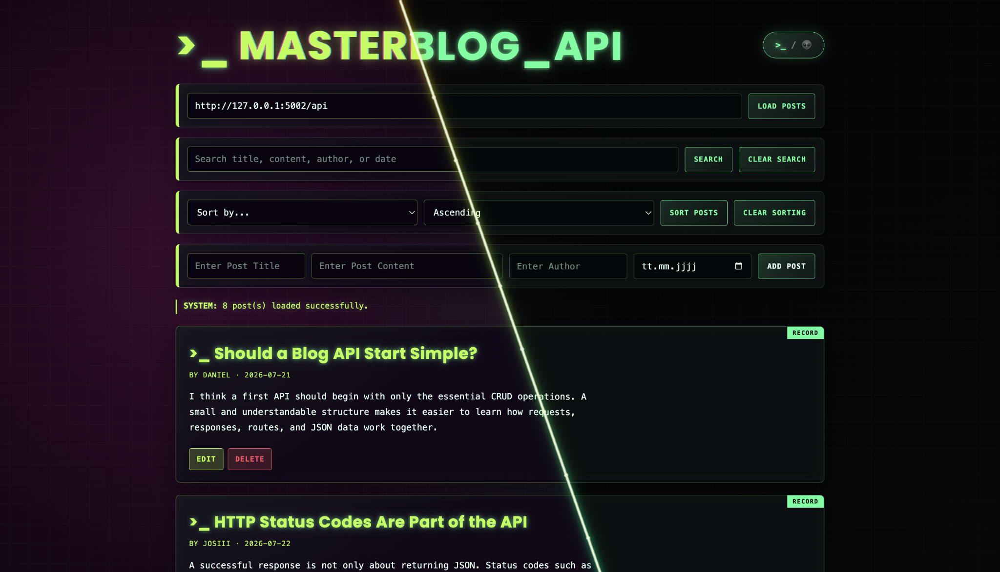

# Masterblog API

A full-stack educational blog application built with **Flask**, **JavaScript**, and a persistent **JSON data store**.  
The project demonstrates a complete REST API workflow, including CRUD operations, validation, search, sorting, interactive Swagger documentation, and a frontend with two switchable visual modes.



## Project overview

Masterblog API began as a small Flask exercise and was extended into a complete client-server application.

The backend provides a RESTful API for managing blog posts. The frontend consumes that API and offers a visual interface for loading, creating, editing, deleting, searching, and sorting posts.

Every post contains:

- `id`
- `title`
- `content`
- `author`
- `date`

Posts are stored in `backend/posts.json`, so they remain available after restarting the server.

## Highlights

- Complete CRUD functionality
- Persistent JSON storage
- Automatic integer ID generation
- Validation for required fields and dates
- Case-insensitive search across all post fields
- Ascending and descending sorting
- Real date-based sorting with `datetime`
- Interactive Swagger UI
- Visible frontend success and error messages
- Delete confirmation
- Frontend editing through the PUT endpoint
- Responsive neon terminal interface
- Persistent Terminal/Freak display-mode switch
- CORS support for a separately running frontend
- Defensive error handling for file and request failures

## Tech stack

### Backend

- Python
- Flask
- Flask-CORS
- Flask-Swagger-UI
- JSON file storage

### Frontend

- HTML5
- CSS3
- Vanilla JavaScript
- Fetch API
- Local Storage

## Project structure

```text
Masterblog-API/
├── .gitignore
├── README.md
├── requirements.txt
├── backend/
│   ├── backend_app.py
│   ├── posts.json
│   └── static/
│       └── masterblog.json
├── docs/
│   └── images/
│       └── masterblog-api-modes.png
└── frontend/
    ├── frontend_app.py
    ├── static/
    │   ├── main.js
    │   └── styles.css
    └── templates/
        └── index.html
```

## Installation

Clone the repository:

```bash
git clone https://github.com/DanielMS616/Masterblog-API.git
cd Masterblog-API
```

Create and activate a virtual environment:

```bash
python3 -m venv .venv
source .venv/bin/activate
```

Install the dependencies:

```bash
python3 -m pip install -r requirements.txt
```

## Run the application

The backend and frontend run as separate Flask applications.

### 1. Start the backend

```bash
python3 backend/backend_app.py
```

The API is available at:

```text
http://127.0.0.1:5002/api
```

The backend must remain on port `5002` for the school/Codio environment.

### 2. Start the frontend

Open a second terminal:

```bash
python3 frontend/frontend_app.py
```

Open the frontend in a browser:

```text
http://127.0.0.1:5001
```

The API base URL field should contain:

```text
http://127.0.0.1:5002/api
```

## API documentation

Interactive Swagger documentation is available while the backend is running:

```text
http://127.0.0.1:5002/api/docs
```

The Swagger definition is stored in:

```text
backend/static/masterblog.json
```

## API endpoints

| Method | Endpoint | Description |
|---|---|---|
| `GET` | `/api/posts` | Return all posts |
| `GET` | `/api/posts?sort=<field>&direction=<asc|desc>` | Return sorted posts |
| `GET` | `/api/posts/search?search=<term>` | Search all supported post fields |
| `POST` | `/api/posts` | Create a new post |
| `PUT` | `/api/posts/<post_id>` | Update an existing post |
| `DELETE` | `/api/posts/<post_id>` | Delete an existing post |

### Supported sort fields

```text
title
content
author
date
```

### Supported sort directions

```text
asc
desc
```

## Example requests

### Create a post

```bash
curl -X POST http://127.0.0.1:5002/api/posts \
  -H "Content-Type: application/json" \
  -d '{
    "title": "Why API Validation Matters",
    "content": "The backend must validate every incoming request.",
    "author": "Daniel",
    "date": "2026-07-28"
  }'
```

### Search posts

```bash
curl "http://127.0.0.1:5002/api/posts/search?search=swagger"
```

The search is case-insensitive and checks:

- title
- content
- author
- date

### Sort by date

```bash
curl "http://127.0.0.1:5002/api/posts?sort=date&direction=desc"
```

### Update a post

```bash
curl -X PUT http://127.0.0.1:5002/api/posts/1 \
  -H "Content-Type: application/json" \
  -d '{
    "title": "Updated API Post",
    "author": "DanielMS616"
  }'
```

Fields omitted from a PUT request keep their current values.

### Delete a post

```bash
curl -X DELETE http://127.0.0.1:5002/api/posts/1
```

## Request validation

A new post requires all four user-provided fields:

```json
{
  "title": "Post title",
  "content": "Post content",
  "author": "Author name",
  "date": "2026-07-28"
}
```

The backend validates:

- that the request body contains a JSON object
- that all required fields are present
- that text fields are not empty
- that the date is valid
- that the date uses the `YYYY-MM-DD` format

Typical HTTP status codes include:

| Status | Meaning |
|---|---|
| `200 OK` | Request completed successfully |
| `201 Created` | New post created |
| `400 Bad Request` | Invalid request data |
| `404 Not Found` | Post ID does not exist |
| `500 Internal Server Error` | Storage or server failure |

## Persistent JSON storage

Posts are loaded from and saved to:

```text
backend/posts.json
```

The API reads the latest file content for each operation. POST, PUT, and DELETE requests write the complete updated list back to the JSON file.

This approach is intentionally simple and suitable for the scope of the project. A production application would normally replace the JSON file with a database and add safeguards for concurrent writes.

## Frontend features

The frontend supports the full backend workflow:

- Load all posts
- Add a post
- Edit an existing post
- Cancel an edit
- Delete with confirmation
- Search across all fields
- Sort by title, content, author, or date
- Clear search and sorting
- Display API errors and success messages
- Remember the API base URL
- Remember the selected display mode

## Terminal and Freak Mode

The default interface uses a restrained neon terminal design.

The mode switch changes between:

- **Terminal Mode** — green, white, and red terminal styling
- **Freak Mode** — animated alien-inspired colors, glitch effects, and alternate record labels

The selected mode is saved in `localStorage`, so it remains active after reloading the page.

## Quality checks

The project has been checked for:

- valid Python syntax
- valid JavaScript syntax
- valid `posts.json`
- valid Swagger JSON
- balanced CSS rule blocks
- duplicate or missing HTML IDs
- missing project dependencies
- persistent CRUD behavior after a server restart

Useful local checks:

```bash
node --check frontend/static/main.js
python3 -m json.tool backend/posts.json > /dev/null
python3 -m json.tool backend/static/masterblog.json > /dev/null
python3 -m pip check
```

## Codio submission

Start the backend in Codio with:

```bash
python3 backend/backend_app.py
```

Open the Flask application through Codio's application button.

Then run the frontend locally and enter the public Codio API base URL into the frontend's API URL field.

Do not change the backend port from `5002`.

## Possible next steps

A production-oriented next version could add:

- SQL database storage
- automated tests committed to the repository
- authentication and authorization
- pagination
- structured logging
- rate limiting
- atomic or transactional writes
- deployment configuration
- CI/CD checks

## Learning outcomes

This project demonstrates:

- designing RESTful Flask routes
- handling HTTP methods and status codes
- validating JSON request data
- separating frontend and backend responsibilities
- consuming an API with JavaScript
- documenting an API with Swagger
- implementing persistent storage
- handling errors across the complete client-server flow

## Author

**Daniel A.**  
GitHub: [DanielMS616](https://github.com/DanielMS616)

## License

This project was created as an educational software-engineering assignment.
